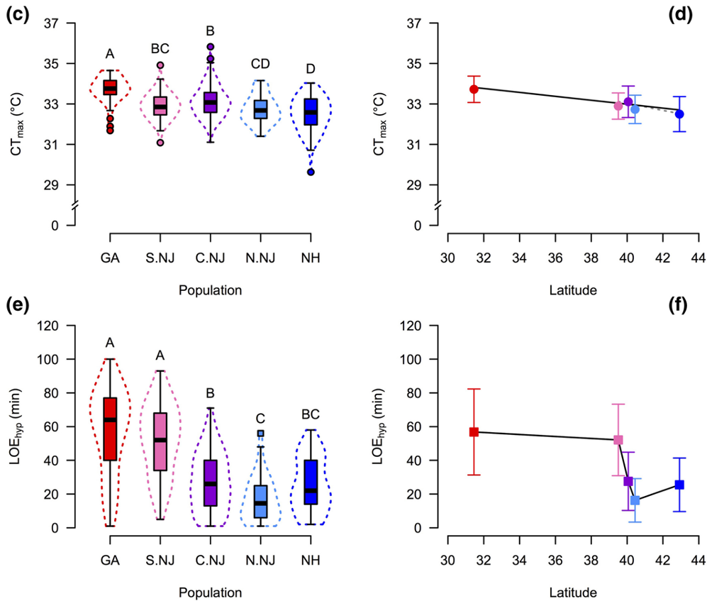

```{r setup, include=FALSE}
knitr::opts_chunk$set(echo = TRUE)
library(kableExtra)
```

<style>
.text-box {
  background-color: #d4e9fc;
  color: black;
  font-size: 14px;
  border-radius: 5px; 
  padding: 20px
}
</style>


# Format of practical

Tentative schedule:

```{r echo = FALSE, results = 'asis',warning=FALSE,message=FALSE}
library(knitr)
library(kableExtra)
#library(pander)
mytable = read.csv('schedule.csv',header=T)
options(knitr.kable.NA = '')

kbl(mytable) %>%
  kable_styling(bootstrap_options = "striped", full_width = F, position = "left",
                fixed_thead = T) %>% 
  column_spec(1, bold=F, width = "3em") %>%
  column_spec(2, bold=T, width = "8em") %>%
  column_spec(3, width = "20em") %>%
  column_spec(4, width = "20em") %>%
  column_spec(5, width = "20em") %>%
  column_spec(6, width = "20em") %>%
  row_spec(seq(1,10,2), bold = F, color = "black", background = "#FFF3C0") %>%
  row_spec(0, color = "black")

```

# Study system we'll be focusing on

Our study system will be the killifish, [Fundulus heteroclitus](https://www.dnr.sc.gov/marine/mrri/acechar/speciesgallery/Fish/Mummichog/index.html#:~:text=Mummichogs%2C%20locally%20called%20mud%20minnows,and%20other%20shallow%20coastal%20habitats.) (also called mummichog or mud minnow). 

This species is the best for lots of reasons. They're broadly distributed along the east coast of North America, from Florida into Canada. 

This sp{width=400px}

They're the most abundant vertebrate in the habitats where they live and, given their broad range, they're super tolerant of lots of conditions: broad temperatures, salinity, hypoxia, among others. They also don't move much, with an adult typically staying in the marsh where it is born and not moving more than a few hundred meters over its life. 

<div class="text-box">

Given the high population sizes and low migration, what might we predict about populations of killifish from different regions of their distribution?

</div>

## study system

We're going to work with data from a 2018 paper in Global Change Biology, led by Tim Healy [link to paper](https://doi.org/10.1111/gcb.14386). I encourage you NOT to look at the publication, as we're going to go through a bunch of these results together for this tutorial. 

We sampled fish from across the range of the eastern United States, about 30 fish per site. Below is a map of the sampling locations. We knew about their population structure ahead of time, so if you're thinking the sampling looks funny, it will become clear why we did this as we analyze the data together. 

{width=400px}

There are also a lot of interesting phenotypic differences between populations with higher temperature tolerance and hypoxia tolerance in southern populations relative to northern populations.

{width=400px}

Given this, there is evidence for local adaptation and we might expect to see population structure. In the tutorial the rest of the week, you're going to analyze this dataset to identify patterns of population structure and signals of selection.


# Cloudlab

We're going to be doing our analyses on cloudlab, hosted by CAU. You should all have access to cloudlab at the following link: ADDLINK

Cloudlab is super nice for this course because you won't have to run anything on your computer. Instead, you can login via a web browser and run everything remotely in [JupyterLab](https://jupyter.org/). I have pre-installed all the necessary R packages and other bioinformatic programs. Also all data you'll need has been uploaded. 

Within your environment, there are a few things to keep in mind. 

There are two main places things are stored:
- `course_materials`
- `my_materials`

`course_materials` is where the class wide files live- datasets, etc. `my_materials` is where you will save your own files. **any data or files your generate that are not saves in `my_materials` will be deleted when you log out!** You can download files 

You'll also notice that you can start R Studio or terminal. Generally, we will run most analyses in the terminal and plot things in R. 

<div class="text-box">

Go to Cloudlab and we'll look at things together. 

</div>

# unix tutorial

http://korflab.ucdavis.edu/bootcamp.html


# Lecture: NGS, WGS, RAD-seq, etc

Illumina, explain barcodes.

https://learn.gencore.bio.nyu.edu/ngs-file-formats/sambam-format/

#### exercise
how many cut sites do we expect in a 1GB genome?


http://marinetics.org/teaching/hts/20150530RADSeq.pdf
https://marinetics.org/teaching/hts/Trimming.html

https://marineomics.github.io/RADseq.html#First,_look_at_the_raw_data

https://wikis.utexas.edu/display/bioiteam/in+silico+digestion


## exercise
unix tutorial

