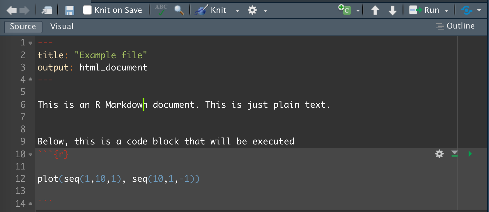
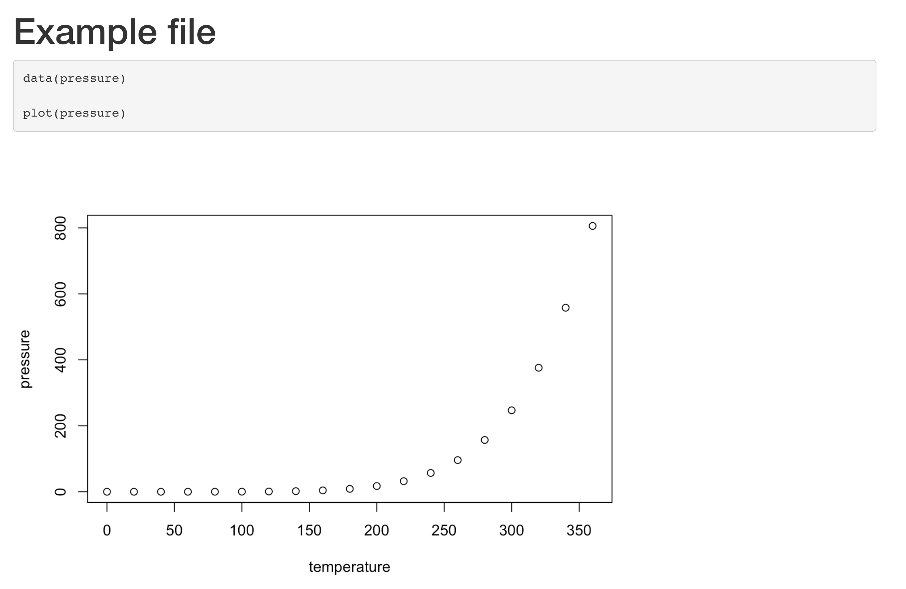

  
  
<style>
  .text-box {
    background-color: #d4e9fc;
      color: black;
    font-size: 14px;
    border-radius: 5px; 
    padding: 20px
  }
</style>
  
<style>
  .lecture-box {
    background-color: #f7e1fc;
      color: black;
    font-size: 14px;
    border-radius: 5px; 
    padding: 20px
  }
</style>

```{css echo=FALSE}
.bordered{
  border-style: solid;
}
```
  
## Why Markdown and R Markdown

At this point in science, all papers need to include a repository of code the completely reproduce analyses. There are many ways to do this, but one simple approach is to use Markdown, which is a plain text formatting syntax designed to be converted to HTML and other formats (pdf, etc). These can then be shared via github, zenodo, dryad, and other sources. For my own work, I use markdown to take notes and track analyses as well as to organize my repositories associated with publications. To demonstrate the importance of open and reproducible science, I reject all papers that I review that do not have code openly available. 

R Markdown is an extension of basic markdown that can embed and run R code, generate plots, etc. This is designed to be run in R Studio- its a good choice if most of your analyses are in R. You can make your results fully reproducible and generate plots, conduct analyses within the document. There are other methods that are similar to this, such as juypter notebooks, which are also excellent. Different tools have different strengths and are focused on different languages. The key is that all are reproducibile and rely on markdown to some extent. 

Related, this whole website and course is written in R Markdown. In my opinion, its a cool and useful tool.

For a general overview of R Markdown, see the [website here](https://rmarkdown.rstudio.com/lesson-1.html). 

## What does Rmarkdown look like?

To remind you, R Markdown is just plain text. The files end in `.Rmd`, but otherwise are just text files. Below is an example where we have three main parts. 

1. Lines 1-4: Metadata telling how you'd like the document formatted
2. Lines 5-9: Plain text
3. Lines 10-14: Code chunk, specified by "```" and the laguage (r)

{width=600px}

### Knitting

To convert the `Rmd` file to its rendered format (in our case html), you "knit" it by clicking the Knit button on the R Studio toolbar- the blue yarn and needle. 

<br>

<div class="text-box">

Make your own R markdown file by going to file -> new file -> R Markdown. You can name it whatever you want. 

Make a code chunk and plot some made up data. For example you could load the `pressure` dataset using the `data()` command, then plot these data using `plot(pressure)`. 

</div>

<br>


Hopefully you see something like this:

<div class="bordered">
{width=600px}
</div>

For your own analyses, you would change the r code within the code block. 

## Code block details

There are more choices within code blocks. 

For example, you can ask for the R code to be excluded from the rendered document by changing the first line to `{r, echo=FALSE}`. 

You can also ask certain blocks not to execute by adding `{r, eval=FALSE}`

<br>

<div class="text-box">

Alter the code block options and see how your rendered document changes. 

Why would we want to not run or show some code blocks?

</div>

<br>

### changing language

Note that we will be using both bash and R. You can change the language of the code chunk by changing `{r}` to `{bash}` or whatever other language. 

## More markdown options

You don't need to know a ton of details to make markdown work on its basic level. The more options you know, the "prettier" your documents might look. Below are a few major options, but there are many more that you can look up at ??????

### headers

headers are indicated by `#`. The highest level header (i.e., largest text and top level) are a single `#`. Additional `##` gives you the next levels down. For example:

```{eval=F}

# Header 1

## Header 2

```

<br>

<div class="text-box">

Add different headers to your document. 

</div>

<br>

### lists

It can also be nice to make lists. These are made using `-` followed by text. 

<br>

<div class="text-box">

Add a list of a few lines to your document.

Can you make your list numbered instead? How do you think you would indent your list? Try this.

</div>

<br>

### other options

There are many, many other options. For example, you can add tables either directly or from a csv file. You can also embed images or links easily. We won't go through this now, but be aware that these are options that are useful. For instance, if you have an analysis that is slow to run, you might run this outside of your R Markdown document and add the resulting plot instead of executing it in the markdown document itself.

Find a list of the common options here????? or ask chat GPT for help doing what you want to do.


