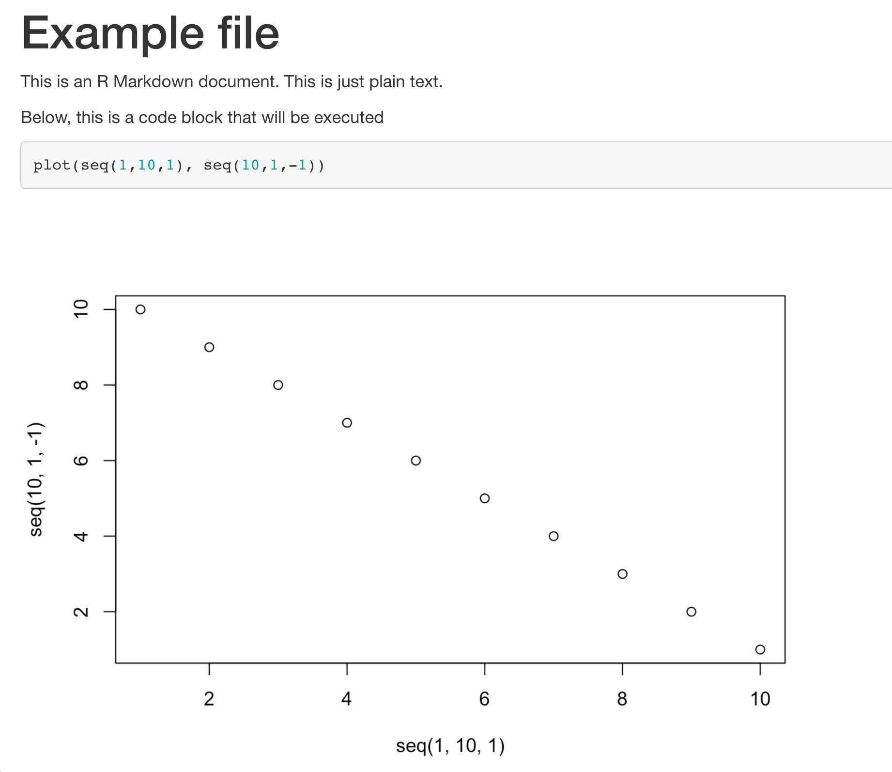

  
  
<style>
  .text-box {
    background-color: #d4e9fc;
      color: black;
    font-size: 14px;
    border-radius: 5px; 
    padding: 20px
  }
</style>
  
<style>
  .lecture-box {
    background-color: #f7e1fc;
      color: black;
    font-size: 14px;
    border-radius: 5px; 
    padding: 20px
  }
</style>

```{css echo=FALSE}
.bordered{
  border-style: solid;
}
```
  
<br>
<div class = "lecture-box">
  
  Short lecture on methods to detect population structure.

</div>
  
<br>
  
# Why R Markdown

very nice overview: https://rmarkdown.rstudio.com/lesson-1.html

{width=600px}

The above chunk of code makes the following document:


<div class="bordered">
{width=600px}
</div>


## changing code block languange

to finish all of this still


