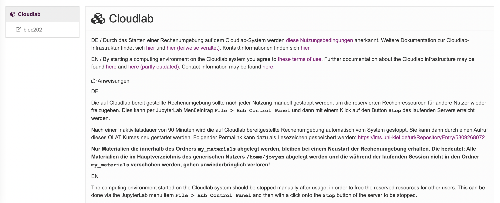
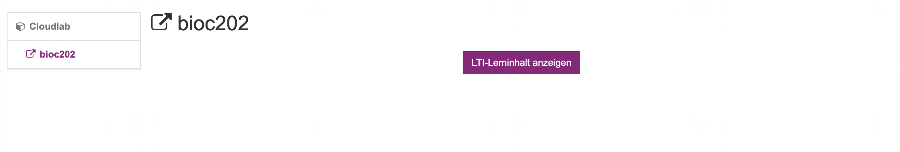
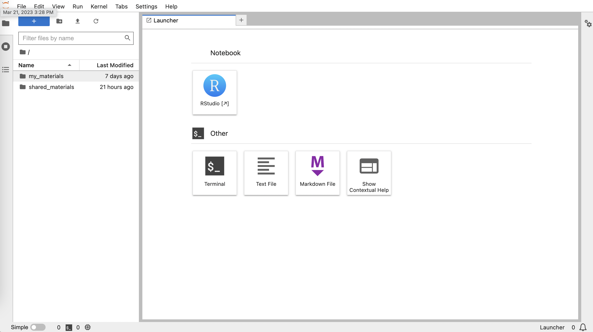

```{r setup, include=FALSE}
knitr::opts_chunk$set(echo = TRUE)
library(kableExtra)
library(knitr)
library(dplyr)
library(tidyr)  
```

<style>
.text-box {
  background-color: #d4e9fc;
  color: black;
  font-size: 14px;
  border-radius: 5px; 
  padding: 20px
}
</style>

We're going to be doing our analyses on cloudlab, hosted by CAU. Cloudlab is super nice for this course because you won't have to run anything on your computer. Instead, you can login via a web browser and run everything remotely in [JupyterLab](https://jupyter.org/). I have pre-installed all the necessary R packages and other bioinformatic programs. Also all data you'll need has been uploaded. 

You should all have access to cloudlab at the following link via OLAT:

https://lms.uni-kiel.de/auth/RepositoryEntry/5309268072/CourseNode/107413362968797

or

https://lms.uni-kiel.de/url/RepositoryEntry/5309268072

You will be asked to login via OLAT. After this you should see the following screen.


<center>
{width=600px}
</center>

<br>

You then need to go to `bioc202`, on the left side where you can click the `LTI-Lerninhalt anzeigen` button to be taken to cloud lab.

<br>

<center>
{width=600px}
</center>

<br>

Then you should see the following jupyterlab screen

<br>

<center>
{width=600px}
</center>

<br>

## Working in cloudlab

<br>

Within your environment, there are a few things to keep in mind. 

There are two main places things are stored:

- `shared_materials`: where the class wide files live- datasets, etc.
- `my_materials`: where you will save your own files

<br>

**any data or files your generate that are not saves in `my_materials` will be deleted when you log out!** 

<br>

You can download files to your computer by right clicking on a file and selecting `download`. Alternatively, you can upload to `my_materials` by highlighting that folder and clicking the up arrow. 

You'll see large buttons for R Studio or terminal. We will run most analyses in the terminal and plot things in R. 

<br>

<div class="text-box">

Go to Cloudlab and make sure you have access. We'll look at things together. 

</div>

