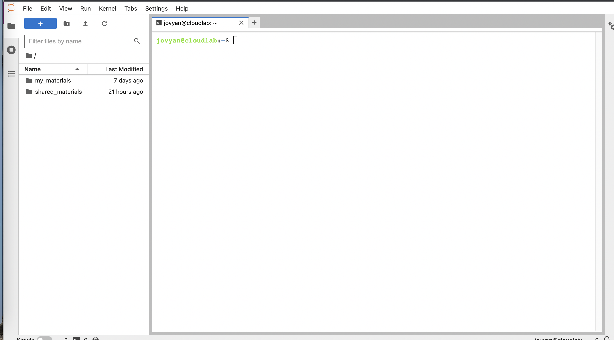

 
<style>
  .text-box {
    background-color: #d4e9fc;
      color: black;
    font-size: 14px;
    border-radius: 5px; 
    padding: 20px
  }
</style>
  
<style>
  .lecture-box {
    background-color: #f7e1fc;
      color: black;
    font-size: 14px;
    border-radius: 5px; 
    padding: 20px
  }
</style>


# Command-line Bootcamp

<br><br><br>


## Introduction 

test changes

This tutorial is from Keith Bradnam, and modified here to fit our file structure and cloudlab. See the original at: https://github.com/KorfLab/unix_and_perl . The original version is licensed under [CC 4.0](http://creativecommons.org/licenses/by/4.0/). I have made small changes so that the output shown is what you'll see in cloudlab, but the bulk and the actual hard work is original from the prior source.

This 'bootcamp' is intended to provide the reader with a basic overview of essential Unix/Linux commands that will allow them to navigate a file system and move, copy, edit files. It will also introduce a brief overview of some 'power' commands in Unix. It was orginally developed as part of a [Bioinformatics Core](http://bioinformatics.ucdavis.edu) Workshop taught at UC Davis ([Using the Linux Command-Line for Analysis of High Throughput Sequence Data](http://training.bioinformatics.ucdavis.edu/docs/2015/06/june-2015-workshop/index.html)).


## Why Unix?

The [Unix operating system][Unix] has been around since 1969. Back then there was no such thing as a graphical user interface. You typed everything. It may seem archaic to use a keyboard to issue commands today, but it's much easier to automate keyboard tasks than mouse tasks. There are several variants of Unix (including [Linux][Linux]), though the differences do not matter much for most basic functions.

[Unix]: http://en.wikipedia.org/wiki/Unix
[Linux]: http://en.wikipedia.org/wiki/Linux

The raw output of genomic data is in the form of large text files. Unix is particularly suited to working with such files and has  powerful (and flexible) commands that can process your data for you. The real strength of learning Unix is that most of these commands can be combined in an almost unlimited fashion. So if you can learn just five Unix commands, you will be able to do a lot more than just five things.

--- 

## 1. The Terminal ##

A *terminal* is the common name for the program that does two main things. It allows you to type input to the computer (i.e. run programs, move/view files etc.) and it allows you to see output from those programs. All Unix machines will have a terminal program available.

Go to cloudlab and open the terminal. You should now see something that looks like the following:

{width=600px}

--- 

## 2. Your first Unix command ##

It's important to note that you will always be *inside* a single directory when using the terminal. The default behavior is that when you open a new terminal you start in your own *home* directory (containing files and directories that only you can modify). To see what files and directories are in our home directory, we need to use the [ls][] command. This command lists the contents of a directory. 


<br>

<div class="text-box">

enter  `ls` into your terminal

</div>

<br>


You should see something like:

```bash
jovyan@cloudlab:~$ ls
my_materials  shared_materials
jovyan@cloudlab:~$
```

There are four things that you should note here:

1. The `jovyan@cloudlab:~$` text that you see is the Unix [command prompt][]. In this case, it contains a user name ('jovyan') and the name of the current directory ('~', more on that later). Note that the command prompt might not look the same on different Unix systems. In this case, the `$` sign marks the end of the prompt. 
2. The output of the `ls` command lists two things. In this case, they are both directories, but they could also be files. We'll learn how to tell them apart later on. 
3. After the `ls` command finishes it produces a new command prompt, ready for you to type your next command.
4. If you were on your own computer, you would see something different. That is, you would be in a different directory. This will make more sense later.

The `ls` command is used to list the contents of _any_ directory, not necessarily the one that you are currently in. Try the following:

<br>

<div class="text-box">

enter  `ls /` into your terminal

</div>

<br>


[ls]: http://en.wikipedia.org/wiki/Ls
[command prompt]: http://en.wikipedia.org/wiki/Command_line_interface

---

## 3: The Unix tree and file structure ##

Looking at directories from within a Unix terminal can often seem confusing. But bear in mind that these directories are exactly the same type of folders that you can see if you use any graphical file browser. From the *root* level (`/`) there are usually a dozen or so directories. You can treat the root directory like any other, e.g. you can list its contents:

```bash
jovyan@cloudlab:~$ ls /
bin   dev  home                lib    lib64   media  opt   root  sbin  sys   tmp  var
boot  etc  install-packages.R  lib32  libx32  mnt    proc  run   srv   tini  usr
```

You'll notice some of these names appearing in different colors. Many Unix systems will display files and directories differently by default. Other colors may be used for special types of files. When you log in to a computer you are working with your files in your home directory, and this is often  inside a directory called 'users' or 'home'.


---

## 4: Finding out where you are ##

There may be many hundreds of directories on any Unix machine, so how do you know which one you are in? The command [pwd][] will Print the [Working Directory][] and that's pretty much all this command does:


<br>

<div class="text-box">

enter  `pwd` into your terminal

As a class, let's draw out a file tree on the board.

</div>

<br>


When you log in to a Unix computer, you are typically placed into your _home_ directory. In this example, after we log in, we are placed in a directory called 'jovyan' which itself is a *subdirectory* of another directory called 'home'.  The first forward slash that appears in a list of directory names always refers to the top level directory of the file system (known as the [root directory][]). The remaining forward slash (between 'home' and 'jovyan') delimits the various parts of the directory hierarchy. If you ever get 'lost' in Unix, remember the `pwd` command.

As you learn Unix you will frequently type commands that don't seem to work. Most of the time this will be because you are in the wrong directory, so it's a really good habit to get used to running the `pwd` command a lot.

[pwd]: http://en.wikipedia.org/wiki/Pwd
[Working Directory]: http://en.wikipedia.org/wiki/Working_directory
[root directory]: http://en.wikipedia.org/wiki/Root_directory

---


## 5: Making new directories ##

If we want to make a new directory (e.g. to store some work related data), we can use the [mkdir][] command:


<br>

<div class="text-box">

Make a new directory called `Learning_unix` within your `home` directory

Verify that you have made this directory.

</div>

<br>


[mkdir]: http://en.wikipedia.org/wiki/Tilde#Directories_and_URLs

---

## 6: Getting from 'A' to 'B' ##

We are in the home directory on the computer but we want to to work in the new `Learning_unix` directory. To change directories in Unix, we use the [cd][] command:

<br>

<div class="text-box">

Move to your `Learning_unix` by entering `cd Learning_unix`

</div>

<br>

Notice that — on this system — the command prompt has expanded to include our current directory. This doesn't happen by default on all Unix systems, but you should know that you can configure what information appears as part of the command prompt.

<br>

<div class="text-box">

Make a new directory within `Learning_unix` called `Outer_directory`. 

Within `Outer_directory` make a new directory called `Inner_directory`

Move to `Inner_directory`

</div>

<br>

Now our command prompt is getting quite long, but it reveals that we are three levels beneath the home directory. We created the two directories in separate steps, but it is possible to use the `mkdir` command in way to do this all in one step. 

Like most Unix commands, `mkdir` supports *command-line options* which let you alter its behavior and functionality. Command-like options are — as the name suggests — optional arguments that are placed after the command name. They often take the form of single letters (following a dash). If we had used the `-p` option of the `mkdir` command we could have done this in one step. E.g.

```bash
mkdir -p Outer_directory/Inner_directory
```

***Note the spaces either side the `-p`!***

[cd]: http://en.wikipedia.org/wiki/Cd_(command)


---


## 7: Getting home ##

There are two ways to get to our "home" directory, which is `/home/jovyan`. 

First, we could move to our base directory `/` then to `home` then to `jovyan`.

<br>

<div class="text-box">

Move to your "home" as shown above.

</div>

<br>

Alternatively, you could have just moved there in one go:, 

```bash
cd /home/jovyan/
```

The leading `/` is incredibly important. The following two commands are very different:

<br>

<div class="text-box">

Try these two commands and see where you end up:

```bash
cd /home/jovyan/

cd home/jovyan/
```

</div>

<br>


The first command says go the `jovyan` directory that is beneath the `home` directory that is at the top level (the root) of the file system. There can only be one `/home/jovyan` directory on any Unix system. 

The second command says go to the `jovyan` directory that is beneath the `home` directory that is located wherever I am right now. There can potentially be many `home/jovyan` directories on a Unix system (though this is unlikely).

Learn and understand the difference between these two commands.


---

## 8: Navigating upwards in the Unix filesystem ##

Frequently, you will find that you want to go 'upwards' one level in the directory hierarchy. Two dots `..` are used in Unix to refer to the _parent_ directory of wherever you are. Every directory has a parent except the root level of the computer. 

<br>

<div class="text-box">

Go into the `Learning_unix` directory and then navigate up two levels using `cd ..`


What if you wanted to navigate up _two_ levels in the file system in one go? It's very simple, just use two sets of the `..` operator, separated by a forward slash: `cd ../..`


</div>

<br>

--- 
    
## 9: Absolute and relative paths ##

Using `cd ..` allows us to change directory _relative_ to where we are now. You can also always change to a directory based on its _absolute_ location. E.g. if you are working in the `/home/jovyan/Learning_unix` directory and you then want to change to the `/tmp` directory, then you could do either of the following:

    jovyan@cloudlab:~/Learning_unix$ cd ../../../tmp/

or...

    jovyan@cloudlab:~/Learning_unix$ cd /tmp

They both achieve the same thing, but the 2nd example requires that you know about the full _path_ from the root level of the computer to your directory of interest (the 'path' is an important concept in Unix). Sometimes it is quicker to change directories using the relative path, and other times it will be quicker to use the absolute path.

---

## 10: Finding your way back home ##

Remember that the command prompt shows you the name of the directory that you are currently in, and that when you are in your home directory it shows you a tilde character (`~``) instead? This is because Unix uses the tilde character as a short-hand way of [specifying a home directory][home directory].

<br>

<div class="text-box">

See what happens when you try the following commands (use the `pwd` command after each one to confirm the results if necessary):

```bash
cd / 
cd ~ 
cd
```
</div>

<br>


Hopefully, you should find that `cd` and `cd ~` do the same thing, i.e. they take you back to your home directory (from wherever you were). You will frequently want to jump straight back to your home directory, and typing `cd` is a very quick way to get there.

You can also use the `~` as a quick way of navigating into subdirectories of your home directory when your current directory is somewhere else. I.e. the quickest way of navigating from the root directory to your `Learning_unix` directory is as follows:

```bash
jovyan@cloudlab:~$ cd /
jovyan@cloudlab:/$ cd ~/Learning_unix
```
[home directory]: http://en.wikipedia.org/wiki/Tilde#Directories_and_URLs

---

##11: Making the `ls` command more useful ##

Time to learn another useful command-line option. If you add the letter 'l' to the `ls` command it will give you a longer output compared to the default:

<br>

<div class="text-box">

See what happens when you try the following commands (use the `pwd` command after each one to confirm the results if necessary):

move to  your home directory. 

enter `ls -l`

</div>

<br>

For each file or directory we now see more information (including file ownership and modification times). The 'd' at the start of each line indicates that these are directories. There are many, many different options for the `ls` command. Try out the following (against any directory of your choice) to see how the output changes.

<br>

<div class="text-box">

See what happens when you try the following commands:

```bash
ls -l 
ls -r
ls -t
ls -l -t -r 
ls -ltr
ls -lh
```
</div>

<br>


Note that the last examples combine multiple options but only use one dash. This is a very common way of specifying multiple command-line options. You may be wondering what some of these options are doing. It's time to learn about Unix documentation....

---

## 12: Man pages ##

If every Unix command has so many options, you might be wondering how you find out what they are and what they do. Well, thankfully every Unix command has an associated 'manual' that you can access by using the `man` command. E.g.

<br>

<div class="text-box">

```bash
man ls 
man cd
man man # yes even the man command has a manual page
```

</div>

<br>

When you are using the man command, press `space` to scroll down a page, `b` to go back a page, or `q` to quit. You can also use the up and down arrows to scroll a line at a time. The man command is actually using another Unix program, a text viewer called `less`, which we'll come to later on.

---

## 13: Removing directories ##

We now have a few (empty) directories that we should remove. To do this use the [rmdir][] command, this will only remove empty directories so it is quite safe to use. If you want to know more about this command (or any Unix command), then remember that you can just look at its man page.

<br>

<div class="text-box">

```bash
cd ~/Learning_unix/Outer_directory/
 rmdir Inner_directory/
cd ..
~/Learning_unix$ 
~/Learning_unix$ ls
```
</div>

<br>

*** Note, you have to be outside a directory before you can remove it with `rmdir` ***

[rmdir]: http://en.wikipedia.org/wiki/Rmdir

---

## 14: Using tab completion ##

Saving keystrokes may not seem important, but the longer that you spend typing in a terminal window, the happier you will be if you can reduce the time you spend at the keyboard. Especially, as prolonged typing is not good for your body. So the best Unix tip to learn early on is that you can [tab complete][] the names of files and programs on most Unix systems. Type enough letters that uniquely identify the name of a file, directory or program and press tab...Unix will do the rest. E.g. if you type 'tou' and then press tab, Unix should autocomplete the word to 'touch' (this is a command which we will learn more about in a minute). In this case, tab completion will occur because there are no other Unix commands that start with 'tou'. If pressing tab doesn't do anything, then you have not have typed enough unique characters. In this case pressing tab _twice_ will show you all possible completions. This trick can save you a LOT of typing!

Navigate to your home directory, and then use the `cd` command to change to the `Learning_unix` directory. Use tab completion to complete directory name. If there are no other directories starting with 'L' in your home directory, then you should only need to type 'cd' + 'L' + 'tab'.

>***Tab completion will make your life easier and make you more productive!***

Another great time-saver is that Unix stores a list of all the commands that you have typed in each login session. You can access this list by using the [history][] command or more simply by using the up and down arrows to access anything from your history. So if you type a long command but make a mistake, press the up arrow and then you can use the left and right arrows to move the cursor in order to make a change.

[tab complete]: http://en.wikipedia.org/wiki/Command_line_completion
[history]: http://en.wikipedia.org/wiki/History_(Unix)

---

## 15: Creating empty files with the touch command ##

The following sections will deal with Unix commands that help us to work with files, i.e. copy files to/from places, move files, rename files, remove files, and most importantly, look at files. First, we need to have some files to play with. The Unix command [touch][] will let us create a new, empty file. The touch command does other things too, but for now we just want a couple of files to work with.

<br>

<div class="text-box">

```bash
cd Learning_unix/
touch heaven.txt
touch earth.txt
ls
```

</div>

<br>

[touch]: http://en.wikipedia.org/wiki/Command_line_completion

---

## 16: Moving files ##

Now, let's assume that we want to move these files to a new directory ('Temp'). We will do this using the Unix [mv][] (move) command. Remember to use tab completion:

<br>

<div class="text-box">

make a new directory called `Temp`. 

enter: `mv heaven.txt Temp/` and `mv earth.txt Temp/`. 

Check that these files have moved to `Temp`

</div>

<br>

For the `mv` command, we always have to specify a source file (or directory) that we want to move, and then specify a target location. If we had wanted to we could have moved both files in one go by typing any of the following commands:

```bash
mv *.txt Temp/ 
mv *t Temp/ 
mv *ea* Temp/
```

The asterisk `*` acts as a [wild-card character][], essentially meaning 'match anything'. The second example works because there are no other files or directories in the directory that end with the letters 't' (if there was, then they would be moved too). Likewise, the third example works because only those two files contain the letters 'ea' in their names. Using wild-card characters can save you a lot of typing.

[mv]: http://en.wikipedia.org/wiki/Mv
[wild-card character]: http://en.wikipedia.org/wiki/Wildcard_character

---

## 17: Renaming files ##

In the earlier example, the destination for the `mv` command was a directory name (Temp). So we moved a file from its source location to a target location, but note that the target could have also been a (different) file name, rather than a directory. E.g. let's make a new file and move it whilst renaming it at the same time:

<br>

<div class="text-box">

In your `~/Learning_unix` directory, make a new file called rags using: `touch rags`

Move this file to `Temp` and rename it to `riches` using `mv rags Temp/riches`

Check that your file has moved and been renamed.

</div>

<br>

In this example we create a new file ('rags') and move it to a new location and in the process change the name (to 'riches'). So `mv` can rename a file as well as move it. The logical extension of this is using `mv` to rename a file without moving it (you have to use `mv` to do this as Unix does not have a separate 'rename' command):

---
    
## 19: Removing files ##

You've seen how to remove a directory with the `rmdir` command, but `rmdir` won't remove directories if they contain any files. So how can we remove the files we have created (inside `Learning_Unix/Temp`)? In order to do this, we will have to use the [rm][] (remove) command.

>***Please read the next section VERY carefully. Misuse of the `rm` command can lead to needless death & destruction*** 

Potentially, `rm` is a very dangerous command; if you delete something with `rm`, you will not get it back! It is possible to delete everything in your home directory (all directories and subdirectories) with `rm`, that is why it is such a dangerous command.

Let me repeat that last part again. It is possible to delete EVERY file you have ever created with the `rm` command. Are you scared yet? You should be. Luckily there is a way of making `rm` a little bit safer. We can use it with the `-i` command-line option which will ask for confirmation before deleting anything (remember to use tab-completion):

<br>

<div class="text-box">

Change into you Temp directory and check what files you have in there.

use the command `rm -i earth.txt heaven.txt riches` to remove these three files

Use `ls` to verify that these have been removed.


</div>

<br>

We could have simplified this step by using a wild-card (e.g. `rm -i *.txt`) or we could have made things more complex by removing each file with a separate `rm` command. 

[rm]: http://en.wikipedia.org/wiki/Rm_(Unix)

---

## 20: Copying files ##

Copying files with the [cp][] (copy) command is very similar to moving them. Remember to always specify a source and a target location. Let's create a new file and make a copy of it:

<br>

<div class="text-box">

Make a file called `file1` using `touch`

Make a copy of `file1` by entering `cp file1 file2`

use `ls` to check what files are now present.

</div>

<br>

What if we wanted to copy files from a different directory to our current directory? Let's put a file in our home directory (specified by `~` remember) and copy it to the current directory (`Learning_unix`):

<br>

<div class="text-box">

make a new file in your home directory: `touch ~/file3`

Copy `file3` into your `~/Learning_unix` directory using `cp ~/file3 ~/Learning_unix`

Move to `~/Learning_unix` and make sure this file moved.

Alternatively, you could have moved to `~Learning_unix` first and then copied `file3` using `cp ~/file3 .`. Delete `file3` and try this second approach now.

</div>

<br>


This last step introduces another new concept. In Unix, the current directory can be represented by a `.` (dot) character. You will mostly use this only for copying files to the current directory that you are in.

<br>

<div class="text-box">

Compare the following:

```bash
ls 
ls . 
ls ./
```

</div>

<br>


In this case, using the dot is somewhat pointless because `ls` will already list the contents of the current directory by default. Also note how the trailing slash is optional. 

[cp]: http://en.wikipedia.org/wiki/Cp_(Unix)

---

## 22: Viewing files with less ##

So far we have covered listing the contents of directories and moving/copying/deleting either files and/or directories. Now we will quickly cover how you can look at files. The [less][less command] command lets you view (but not edit) text files.

<br>

<div class="text-box">

use echo to print some text `echo "Call me Ishmael."`

Then you can add this text directly to a new file: `echo "Call me Ishmael." > opening_lines.txt`

Look at this file: `less opening_lines.txt`

</div>

<br>

On its own, `echo` isn't a very exciting Unix command. It just echoes text back to the screen. But we can redirect that text into an output file by using the `>` symbol. This allows for something called file [redirection][].

>***Careful when using file redirection (>), it will overwrite any existing file of the same name***

---

## 23: Viewing files with cat  ##

<br>

<div class="text-box">

Let's add another line to the file:

```bash
echo "The primroses were over." >> opening_lines.txt
cat opening_lines.txt
```

</div>

<br>


Notice that we use `>>` and not just `>`. This operator will **append** to a file. If we only used `>`, we would end up overwriting the file. The [cat][cat command] command displays the contents of the file (or files) and then returns you to the command line. Unlike `less` you have no control on how you view that text (or what you do with it). It is a very simple, but sometimes useful, command. You can use `cat` to quickly combine multiple files or, if you wanted to, make a copy of an existing file:

```bash
cat opening_lines.txt > file_copy.txt
```

[cat command]: http://en.wikipedia.org/wiki/Cat_(Unix)

--- 

## 24: Counting characters and lines in a file ##

Using Unix's [wc][wc command] command (word count), we can count how many lines, words, and characters are in a specified file (or files), but you can use command-line options to give you just one of those statistics (in this case we count lines with `wc -l`).

<br>

<div class="text-box">

```bash
wc opening_lines.txt

wc -l opening_lines.txt
```

</div>

<br>


[wc command]: https://en.wikipedia.org/wiki/Wc_(Unix)

---


## 27: Matching lines in files with grep ##

Open the launcher tab and make a new textfile (i.e., click the text file button to open a new window) to paste the following lines to your file:


    Now is the winter of our discontent.
    All children, except one, grow up.
    The Galactic Empire was dying.
    In a hole in the ground there lived a hobbit.
    It was a pleasure to burn.
    It was a bright, cold day in April, and the clocks were striking thirteen.
    It was love at first sight.
    I am an invisible man.
    It was the day my grandmother exploded.
    When he was nearly thirteen, my brother Jem got his arm badly broken at the elbow.
    Marley was dead, to begin with.

You'll need to rename this file by right clicking it in the navigator on the left. Call this file `opening_lines.txt`

You will often want to search files to find lines that match a certain pattern. The Unix command [grep][] does this (and much more). The following examples show how you can use grep's command-line options to:

+ show lines that match a specified pattern
+ ignore case when matching (`-i`)
+ only match whole words (`-w`)
+ show lines that don't match a pattern (`-v`)
+ Use wildcard characters and other patterns to allow for alternatives (`*`, `.`, and `[]`)

<br>

<div class="text-box">

- Find all lines with "was": `grep was opening_lines.txt`
- Now add the `-v` option to your previous command. What happened?
- Use grep to match "all". 
  - Is this doing what you want? Look quickly at your text file, are there any missing all's?
  - Add the `-i` option to you all grep. 
- Now grep to find and occurrence of "in"in the text.
  - again, is this doing what you want?
  - add the `-w` option to your in grep


</div>

<br>

[grep]: http://en.wikipedia.org/wiki/Grep

---

## 28: Combining Unix commands with pipes ##

One of the most poweful features of Unix is that you can send the output from one command or program to any other command (as long as the second commmand accepts input of some sort). We do this by using what is known as a [pipe][]. This is implemented using the '|' character (which is a character which always seems to be on different keys depending on the keyboard that you are using). Think of the pipe as simply connecting two Unix programs. Here's an example which introduces some new Unix commands:

<br>

<div class="text-box">

Combine your grep command from above with `wc -l` to count how many lines contain "was".

</div>

<br>

>***Whenever making a long pipe, test each step as you build it!***

[pipe]: http://en.wikipedia.org/wiki/Pipe_(Unix)

---


# Other useful commands:

- `head`: view first 10 lines of a file
- `tail`: view last 10 lines of a file
- `cut`: cut out certain column of a file based on a delimiter.


+ Show lines of a file that begin with a start codon (ATG) (the `^` matches patterns at the start of a line):

```bash
grep "^ATG" file.txt
```