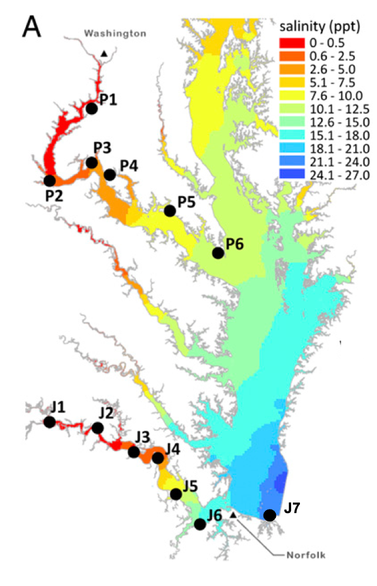

```{r setup, include=FALSE}
knitr::opts_chunk$set(echo = TRUE)
library(kableExtra)
library(knitr)
library(dplyr)
library(tidyr)  
```

<br>

This dataset is again focused on Fundulus heteroclitus, which you know well at this point. You'll be looking along two parallel salinity gradients from marine to freshwater in the Chesapeake Bay in the eastern USA. F. heteroclitus is one of the few fish species that has stable populations in both marine, brackish, and fresh water. There is also ample evidence for local adaptation to salinity where freshwater populations have gained low salinity tolerance at the expense of high salinity performance. For example, each population has better swimming performance in their native salinity ([Brennan et al., 2016](https://doi.org/10.1016/j.cbpa.2016.02.006)), are divergent in their osmoregulatory capabilities and plasticity ([Brennan et al., 2015](https://doi.org/10.1242/jeb.110445); [Brennan et al., 2018](https://doi.org/10.1093/molbev/msy154)), and there is some evidence of reproductive isolation ([Brennan and Whitehead 2023](https://doi.org/10.1111/jeb.14159)).

However, most of this work has been done along a single salinity cline in the Potomac River. This dataset is neat in that it adds a second, parallel salinity cline along the James River. We hypothesize that the freshwater populations are genetically distinct from the more brackish populations. We also might ask if the population structure is similar across both salinity clines and how the populations in the two river compare to one another.

<br>

### Map of sampling locations

<br>

Below is a map of the sampling locations and the salinity cline in each river. The upper river, "P" populations, is the Potomac. The lower, "J" populations, is the James. Washington DC is at the top of the map, for reference. 

<br>

<center>
{width=400px}
</center>


```{bash echo=FALSE, eval=FALSE}
#gzcat fh.filtered.vcf.gz| head -n 100 | grep '^#CHROM' | tr '\t' '\n' | sort > dataset_1_IDs.txt
```

<br>

### Sample numbers

Here are the numbers for each sampling location. Note that you have no J4 sample- the powerplant wouldn't let us get to the river.

```{r, echo=FALSE}
library(knitr)

# Create the data frame
df <- data.frame(
  N = c(10, 7, 10, 10, 10, 10, 10, 7, 10, 10, 10, 10),
  population = c("J1", "J2", "J3", "J5", "J6", "J7", "P1", "P2", "P3", "P4", "P5", "P6")
)

# Add a new column for river based on the population code
df$river <- ifelse(startsWith(df$population, "J"), "James", "Potomac")
df <- df[, c(3, 2, 1)]
#options(knitr.table.format = "html")
knitr::kable(df, align = "c", col.names = c("River", "Population", "N")) %>%
  kable_styling(bootstrap_options = c("striped", "hover", "condensed"), full_width = F,
              font_size = 13)

```

<br>

### Sequencing approach

<br>

We used a sequence capture approach called Rapture. See the [paper describing it](https://doi.org/10.1534/genetics.115.183665) and a [blog post](https://www.molecularecologist.com/2016/02/16/welcome-to-the-rapture/) for more info. In short, this is a combination of RAD-seq and sequence capture and in this case, we're pulling down about 1,000 loci across the genome. If you're wondering, we used this method because it makes sequencing thousands of individuals affordable. We originally were using the approach for [this paper](https://doi.org/10.1111/jeb.14159), but added the parallel salinity clines on as extra.

<br>

### Files

<br>

- VCF: `shared_materials/Project_files/dataset_1/dataset_1.vcf.gz`
- Id of each individual: `shared_materials/Project_files/dataset_1/dataset_1_IDs.txt`
- Population file: `shared_materials/Project_files/dataset_1/dataset_1_Populations.txt`
- lat long for each collection site: `shared_materials/Project_files/dataset_1/dataset_1_lat_long.txt`
- pairwise distances between populations: `shared_materials/Project_files/dataset_1/dataset_1_pairwise_distances.txt`
- There is no phenotype data for these individuals.


```{r, eval=F, echo=F}
library(knitr)

# create the data frame
df <- data.frame(
  River = c("Potomac", "Potomac", "Potomac", "Potomac", "Potomac", "Potomac", "James", "James", "James", "James", "James", "James", "James"),
  Location = c("P1", "P2", "P3", "P4", "P5", "P6", "J1", "J2", "J3", "J4", "J5", "J6", "J7"),
  Latitude = c("38°41′42″N", "38°23′22″N", "38°27′11″N", "38°21′54″N", "38°13′31″N", "38°3′29″N", "37°19′41″N", "37°17′33″N", "37°10′37″N", "37°11′3″N", "37°0′23″N", "36°51′51″N", "36°54′18″N"),
  Longitude = c("77°3′10″W", "77°19′1″W", "77°3′13″W", "76°58′52″W", "76°37′39″W", "76°19′29″W", "77°15′44″W", "77°0′35″W", "76°48′21″W", "76°41′37″W", "76°36′12″W", "76°28′39″W", "76°05′46″W")
)


# convert latitude and longitude to decimal degrees
library(sp)

chd = substr(df$Latitude[1], 3, 3)[1]
chm = substr(df$Latitude[1], 6, 6)[1]
chs = "″"

df$Latitude_DD <- as.numeric(char2dms(df$Latitude,chd=chd,chm=chm,chs=chs))
df$Longitude_DD <- as.numeric(char2dms(df$Longitude,chd=chd,chm=chm,chs=chs))
# create the kable table
kable(df, format = "markdown", align = "c", col.names = c("River", "Location", "Latitude", "Longitude", "Latitude_DD", "Longitude_DD"))

write.table(file="~/Documents/GEOMAR/Teaching/Mar_pop_gen/2023/teaching/Dataset_1_lat_long.txt",df, row.names=F, quote=F)

```


