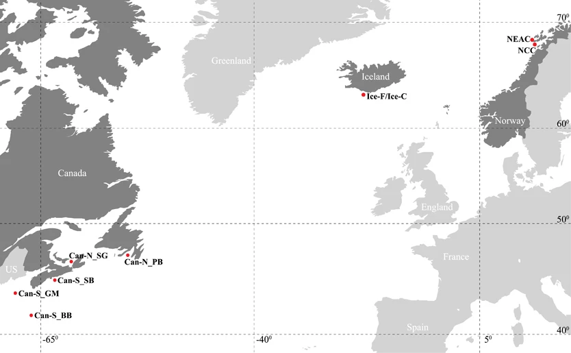

```{r setup, include=FALSE}
knitr::opts_chunk$set(echo = TRUE)
library(kableExtra)
library(knitr)
library(dplyr)
library(tidyr)  
```


These data are from [Berg et al., 2017](http://dx.doi.org/10.1038/hdy.2017.54).

<center>
{width=300px}
</center>


Within cod, there are two ecotypes related to migration, migratory and non-migratory. Migratory cod migrate from their adult habitat to their southern spawning grounds in the spring each year. Conversely, non-migratory cod largely spawn where they are without any significant migration. In terms of conservation implications, it is important to understand the genetic variation underlying such dramatic life-history divergence, particularly as changing environments begin to influence the migration patterns of these populations.  

The question is if there are genomic regions that distinguish migratory from non-migratory individuals as well as what other population structure there might be across the species. The authors sampled migratory and non-migratory cod from Canada, Iceland, and Norway. See the map and table below for more details. The data set consists of 316 individuals from 6 locations with 8,165 snps across all individuals.

All samples were individually genotyped using a 12K Illumina SNP chip for which 8165 SNPs were polymorphic in this data set, had a call rate of >95% and showed Mendelian inheritance in a separate set of individuals with a pedigree.


## table of sampling locations:

|Sampling_ID| Population| migration_status| Latitude| Longitude|
|:---:|:---:|:---:|:---:|:---:|
|Can-N_PB |Can-N |migratory?     |N47.15 |W54.15|
|Can-N_SG |Can-N |migratory?     |N46.13 |W61.39| 
|Can-S_SB |Can-S |non-migratory? |N44.27 |W63.36|
|Can-S_GM |Can-S |non-migratory? |N43.16 |W67.46|
|Can-S_BB |Can-S |non-migratory? |N42.35 |W65.50|
|Ice_F    |Ice_F |Migratory      |N63.49 |W19.59|
|Ice_C    |Ice_C |Nonmigratory   |N63.49 |W19.59|
|NEAC     |NEAC  |Migratory      |N68.19 |E13.30|
|NCC      |NCC   |Nonmigratory   |N68.04 |E13.41|

<center>
{width=500px}
</center>


Note that because these are from a [SNP chip](https://en.wikipedia.org/wiki/SNP_array), there are a few differences from how you would process RAD (or other genomic) data. First, there shouldn't be any linkage, so you won't need to prune. Second, there isn't depth, rather it is "on" or "off", sort of. Finally, there is no mapping, duplication, etc. It would be great if you explained, briefly, during your presentation what a snp chip is. 


```{bash echo=FALSE, eval=FALSE}

cat BergEtAl2017_vcf.vcf | sed 's/pop-[0-9]*_//g' | sed 's/Ice_F-/Ice-F_/g' | sed 's/Ice_C-/Ice-C_/g' | sed 's/NEAC-/NEAC_/g'  | sed 's/NCC-/NCC_/g' > dataset_2.vcf

cat dataset_2.vcf| grep '^#' | tail -n 1 | tr '\t' '\n' | tail -n +10 > dataset_2_IDs.txt

cat dataset_2_IDs.txt | cut -f 1 -d "_" > dataset_2_population.txt
cat dataset_2_IDs.txt | cut -f 2 -d "_" > dataset_2_indiv.txt

paste dataset_2_population.txt dataset_2_indiv.txt > dataset_2_IDs.txt

```


# Data


The vcf file for this dataset is located: `shared_materials/Project_files/dataset_2/dataset_2.vcf`

There is also a file with the id and population of each individuals: `shared_materials/Project_files/Dataset_2/dataset_2_IDs.txt`


