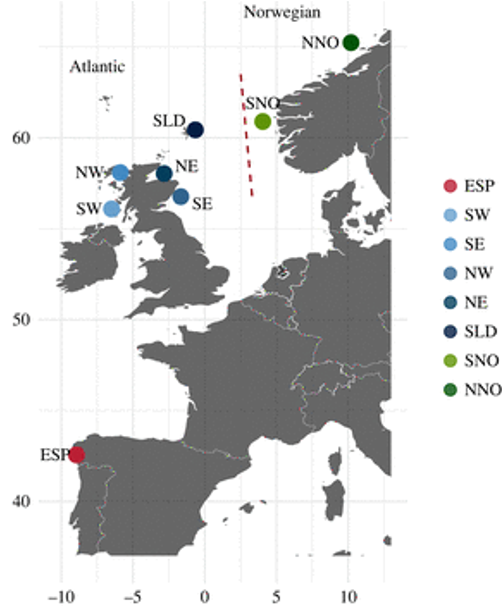

```{r setup, include=FALSE}
knitr::opts_chunk$set(echo = TRUE)
library(kableExtra)
library(knitr)
library(dplyr)
library(tidyr)  
```

## Overview

This dataset is focused on the [King scallop, Pecten maximus](https://en.wikipedia.org/wiki/Pecten_maximus). This species is heavily fished and used in aquaculture, so is important from an economic and fishery perspective. As such, there's been a fair amount of work on this species to understand their genetic structure, local adaptation, and so on. There's also a nice, [chromosome level genome assembly](http://dx.doi.org/10.1093/gigascience/giaa037).

As adults, scallops don't move much, but they have a long pelagic larval stage (up to a month). Despite this, there's strong evidence for local adaptation, particularly to temperature. 

In this dataset, [Hollenbeck et al.](https://doi.org/10.1098/rspb.2022.1573), looked at populations spanning the Norwegian Trench and across a fairly large latitudinal gradient. See the map below for sampling locations.  

<br>

<center>
{width=300px}
</center>

<br>

In this study, the authors know from previous work that there is a population break across the Norwegian Trench. They further hypothesize that there is local adaptation to temperature, particularly in Spain, where temperatures are much warmer and represents the southern edge of the species' distribution.

ddRAD was used to genotype individuals and reads were mapped to the reference genome and SNPs called with freebayes. 

## Sampling locations

Here are the sampling locations and number of individuals from each site.

<br>

| Site                 | Site Code | Latitude | Longitude | N   |
|----------------------|-----------|----------|-----------|-----|
| Spain                | ESP       | 42.561   | -8.949    | 19  |
| Southwest Scotland   | SW        | 56.088   | -6.504    | 15  |
| Southeast Scotland   | SE        | 56.766   | -1.670    | 29  |
| Northeast Scotland   | NE        | 58.035   | -2.834    | 31  |
| Northwest Scotland   | NW        | 58.091   | -5.889    | 32  |
| Shetland Islands     | SLD       | 60.442   | -0.659    | 35  |
| Southern Norway      | SNO       | 60.900   | 4.043     | 20  |
| North-central Norway | NNO       | 65.241   | 10.195    | 20  |

<br>

## Files

<br>

The vcf file for this dataset is located: `shared_materials/Project_files/dataset_3/dataset3.vcf`

Id and population of each individual: `shared_materials/Project_files/dataset_3/id_pops.txt`

Sampling locations: `shared_materials/Project_files/dataset_3/dataset3_coords.csv`

Site mean temperature: `shared_materials/Project_files/dataset_3/dataset3_mean_temps.txt`


